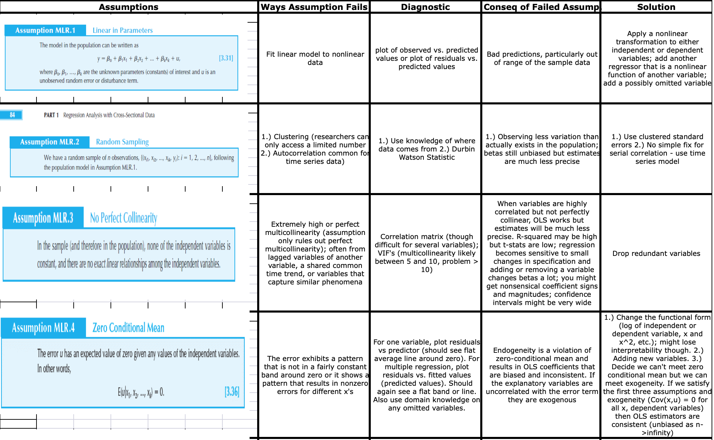
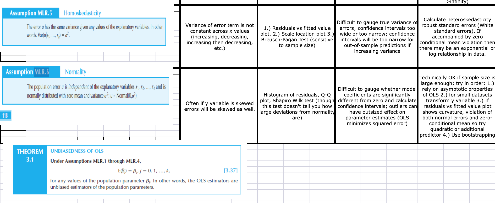

```{r setup, include=FALSE}
knitr::opts_chunk$set(echo = TRUE)
```
---
output:
  pdf_document: default
  html_document: default
---
---
output:
  pdf_document: default
  html_document: default
---


```{r echo=FALSE}
library(car)
library(lmtest)
library(sandwich)
library(stargazer)
library(ggplot2)
library(tidyr)
library(knitr)
library(dplyr)
library(reshape2)

 opts_chunk$set(tidy.opts=list(width.cutoff=60),tidy=TRUE)

```

```{r}
#read in the data
#data <- read.csv(file = 'H:/ROL/MIDS/W203 Stats/lab_3/crime_v2.csv') #Robert

data <- read.csv(file = '~/Desktop/W203/w203_lab3-master/crime_v2.csv') #Praveen


```
###########################################################################################
#
## Ryan's section
# 
###########################################################################################
__1. An Introduction__

As crime has seen an increase in the 1980’s, citizens of North Carolina have been looking to local government politicians to address this growing problem. In preparation for the upcoming election, our team of political consultants has been tasked with providing insight to drive policy directed at reducing crime levels. Before pushing a political campaign aimed at crime reduction, we must first identify the key determinants of crime and their significance in order to properly focus resources to target these issues.

Many studies have examined numerous potential determinants of crimes and it remains a complex and evolving issue. Traditionally, criminal activity is often linked to issues of inequality and poverty. In addition, factors revolving around the criminal justice system are often viewed as having a significant impact, both positive and negative, on crime rate. While there is little debate that these variables affect crime, a one size fits all policy on crime does not properly address the unique issues at the state and county levels. This report aims to identify the complex interactions of crime determinants in North Carolina using recently compiled statistics from FBI and government agencies. 

While many studies have been conducted on individual crime factors, this report examines multiple factors holistically. The primary research question this report addresses is: Which demographic, economic and deterrent factors significantly affect crime? To answer this question, our team has been provided a dataset of 1987 statistics from select North Carolina counties. The data has been pulled from multiple credible sources including:\
* FBI’s Uniform Crime Reports\
* FBI’s police agency employee counts\
* North Carolina Department of Correction\
* North Carolina Employment Security Commission\
* Census Data\

Our dependent variable and the key measure we are focused on is crime rate, which is defined as crimes committed per person. Our independent variables have been grouped into categories of deterrent, demographic, economic, and geographical factors. A comprehensive list of the variables and their respective categories are described in our exploratory data analysis.

While this 1987 dataset provides observational variables that impact crime, the dataset does not provide a comprehensive list of all variables. There are a number of factors that our team has identified that could potentially assist in more accurately measuring a causal effect on crime. These factors are discussed in further detail in the omitted variables section of this report. In addition, this dataset only covers a single cross-section of the data from the year 1987. A multi-year panel of data, if provided, could improve the accuracy of our models and address lead-lag effects. Additional data and experimental studies could provide a more accurate casual model, however the statistical results of this report are limited to the information provided in the 1987 dataset. Using these results, our team has prepared recommendations for a political strategy addressing crime in North Carolina. 

###########################################################################################
#
## Robert's section
# 
###########################################################################################


# 2. A Model Building Process

__Exploratory Data Analaysis__

We started by conducting exploratory data analysis. First, we read the original paper to get a better understanding of each variable. We defined the variables in the table below and grouped them into five groups in order to get a better handle on them. 

```{r}
crime_count <- c(1:25)
data_variables <- c("county","year","crmrte","prbarr","prbconv","prbpris","avgsen","polpc","density","taxpc","west","central","urban","pctmin80","wcon","wtuc","wtrd","wfir","wser","wmfg","wfed","wsta","wloc","mix","pctymle")
data_description <- c("county identifier","1987","crimes committed per person","'probability' of arrest","'probability' of conviction","'probability' of prison sentence","avg. sentence, days","police per capita","people per sq. mile","tax revenue per capita","=1 if in western N.C.","=1 if in central N.C.","=1 if in SMSA","perc. minority, 1980","weekly wage, construction","wkly wge, trns, util, commun","wkly wge, whlesle, retail trade","wkly wge, fin, ins, real est","wkly wge, service industry","wkly wge, manufacturing","wkly wge, fed employees","wkly wge, state employees","wkly wge, local gov emps","offense mix: face-to-face/other","percent young male")
data_group <- c("Control","","","Deterrent","Deterrent","Deterrent","Deterrent","Deterrent","Demographic","Demographic","Region","Region","Urban","Demographic","Wages","Wages","Wages","Wages","Wages","Wages","Wages","Wages","Wages","Demographic","Demographic")
data_notes <- c("","","ratio of FBI index crimes to county population","ratio of arrests to offenses","ratio of convictions to arrests","proportion of total convictions resulting in prison sentences","average sentence in days","","country population divided by county land area","","dummy","dummy","dummy","proportion of country population that is minority or nonwhite","average weekly wage in that sector","average weekly wage in that sector","average weekly wage in that sector","average weekly wage in that sector","average weekly wage in that sector","average weekly wage in that sector","average weekly wage in that sector","average weekly wage in that sector","average weekly wage in that sector","ratio of face-to-face crimes (robbery, assault, rape) to non-face-to-face crimes","proportion of country population that is male between 15 and 24"
)
data_headers <- c("Variable", "Description", "Group", "Note")
data_table <- data.frame(data_variables, data_description, data_group, data_notes)
kable(data_table, col.names = data_headers, caption = "Descriptions and Groups of Variables")

```

To get a better sense of the data set the summary function was run.

```{r}
summary(data)
```

This function provides a high level view of each variable. Six rows have missing values for all variables. In addition, there is one duplicate row. Also the variable prbconv is loaded as a factor, so it needs to be converted to numeric. These issues are handled below to create the initial data set. 

```{r}
#eliminate N/A's (6 rows of NA were removed)
data_crmrte <- data[!is.na(data$crmrte),]

#remove duplicates (1 duplicate record was found)
data_crmrte <- data_crmrte %>% distinct()

#prbconv was defined as factor , we will convert it to numeric
data_crmrte$prbconv <- as.numeric(as.character(data_crmrte$prbconv))
class(data_crmrte$prbconv)
```

With 25 original variables in the data set the natural place to start is with the dependent variable, crmrte. To get a better sense of this variable, the distribution is graphed below.

```{r}
quantile(data_crmrte$crmrte, c(0, .01, .05, .10, .25, .50,  .75, .90, .95, .99, 1.0))
hist(data_crmrte$crmrte,breaks=20)
boxplot(data_crmrte$crmrte, main="Boxplot of crmrte")
plot(data_crmrte$crmrte)
qqnorm(data_crmrte$crmrte)
shapiro.test(data_crmrte$crmrte) # Shapiro-wilk test confirms non-normality
```
__Outlier Analysis__
\
There are several outliers in the variable crmrte and the distribution is right skewed. We have ninety observations so non-normality is not a top concern but this distribution is not perfectly normal. we analyse outliers for crime rate that are > 1.96*Std-dev from the mean crime rate (~0.07)

The largest outliers (6 counties) on the right side of the distribution are examined. There are some insights:
- 1. 4 of out of the 6 outliers are in urban areas
- 2. The average demographic density for the outlier set is  greater than 3 times the average density for the sample
- 3. We also observe that data ppt 53 which has the highest crime rate, also has the highest density amongst the outliers and is a urban area

This is not very surprising as we expect urban areas with high density of population to have more crimes.

we will continue to monitor the impact of the outliers and conisder the treatment of these outlier in later part of the report.
```{r}
data_crmrte[data_crmrte$crmrte > 0.07,] 
```
We also look at the lower range of outliers and find only data pt 51 (county 115) which has crime rate < 0.01. This outlier has some significant outlier effects and will be explored further later in the report.

```{r}
data_crmrte[data_crmrte$crmrte < 0.01,] 

```

For campaign purposes, we want to predict crime. We want our candidate to be able to say that he or she can reduce crime in order to win votes. What is the most effective way to convey that? Using crime rate as it appears in the data set is using the level of crime rate and would suggest the following statement as a campaign slogan - "I can reduce crime to this rate by doing x, y, and z". Transforming crime rate into the log of crime rate allows for the statement "I can reduce crime by n% by doing x, y, and z." We find the latter more powerful and meaningful to voters since voters have no idea about the level of crime rates. In addition, we will show that the transformation of crime rate imrpoves the normaility and distribution of the variable, which will often reduce skew in the errors as well.\
```{r}
data_crmrte$log_crmrte <- log(data_crmrte$crmrte)
hist(data_crmrte$log_crmrte,breaks=20)
boxplot(data_crmrte$log_crmrte, main="Boxplot of log of crmrte")
plot(data_crmrte$log_crmrte)
qqnorm(data_crmrte$log_crmrte)
shapiro.test(data_crmrte$crmrte) # Shapiro-wilk test confirms persistance of non-normality

```
The histogram of the transformed crime rate is much more symmetrical and shows much less right skew. The box plot shows all of the outliers on the high end have been removed, though outlier 51 ( countty 115) on the low end has been become more prominent. 

The scatter plot looks much more normal, and the Q-Q plot is much closer to normal with the data points hugging the 45 degree line much more closely. Given the stronger argument for the political campaign and the benefits to normality we have chosen to model the tranformation of crime rate as opposed to crime rate.
\

__Groupings__\
In order to digest the data in the data set we decided to group the variables into five groups: deterrent, wages, demographic, region, and urban. We performed exploratory data analysis on all of these variables.\

The group is deterrent data. As cited in the original paper, these variables were hypothesized to reduce crime rate through disincentivizing crime. Essentially, as the probability of getting caught increases, criminals' desire to commit crimes decreases.\

__Deterrent Data__\
```{r}
deterrent_data <- data_crmrte[,c('prbarr','prbconv','prbpris','crmrte',
                          'avgsen','polpc')]

ggplot(gather(deterrent_data[,c('prbarr','prbconv','prbpris',
                                    'avgsen','polpc')]), aes(value)) + 
geom_histogram(bins = 10) + facet_wrap(~key, scales = 'free_x')

my_vars1 <- c("prbarr","prbconv","prbpris")
deterrent_data2 <- deterrent_data[my_vars1]
my_vars2 <- c("polpc")
deterrent_data3 <- deterrent_data[my_vars2]

boxplot(deterrent_data2, main="Boxplot of prbarr, prbconv, prbpris")
#boxplot(deterrent_data3, main="Boxplot of polpc")
#boxplot(deterrent_data$avgsen, main="Boxplot of avgsen")
```
\
The first four histograms show right skew while prbpris shows left skew. The biggest outlier is observation 51. This observation has the lowest crime rate in the data set, obviously the highest polpc (police per capita), the highest avg sentence, the third highest prbconv, and the lowest pctmin80. This observation is likely to affect many of the regressions so it will need to be examined further. These variables are candidates to be transformed.\

__Wages Data__\
```{r}
#create a dataframe of just the wage variables
wages_data <- data_crmrte[,c('wcon','wtuc','wtrd','wfir', 'wser',
                      'wmfg','wfed', 'wsta', 'wloc')]

#plot histograms of just the wage variables
ggplot(gather(wages_data), aes(value)) + 
  geom_histogram(bins = 10) + 
  facet_wrap(~key, scales = 'free_x')

#generate boxplots of just the wage variables
boxplot(wages_data)


```
\
There is an obvious outlier for wser in data pt 84 (County 185) . The mean services wage across all the counties is $275 ( with a std dev of  206) and 84 has wser of 2177 (~9sd from mean), which seems like a measurement or typographical error. The next highest average weekly wage in any sector is 646 versus the value of 2177.It is very possible that this data point might add measurement error and we will revisit this later. 

For now, we create an additional variable that is the median of all wage variables for each observation. If it conveys as much information, it has the benefit of increasing our degress of freedom and removing the effect of the outlier.\

```{r}
data_crmrte$median_wage <- apply(data_crmrte[c("wcon", "wtuc", "wtrd",
                                               "wfir", "wser", "wmfg",
                                               "wfed", "wsta", "wloc")], 
                                 1, FUN=median, na.rm=TRUE)

```


Region Data__\
```{r}
#create a dataframe of just the wage variables
dummies_data <- data_crmrte[,c('west','central')]

#plot histograms of just the dummy variables
ggplot(gather(dummies_data), aes(value)) + 
  geom_histogram(bins = 2) + 
  facet_wrap(~key)

#just a quick check that there is no overlap
region_check <- data_crmrte[which(data_crmrte$west == 1 && data_crmrte$central == 1)]

summary(region_check)
```
The regions are broken up into central, west, and east. East is left out of the data set and it's effect as the final level of the indicator variable will move to the intercept.\


__Urban Data__\
```{r}
#plot histograms of just the wage variables
sum(data_crmrte$urban) # There are only 8 Urban areas out of 90 counties
hist(data_crmrte$urban)

```
Urban did not fit into a great grouping so we left this variable on its own. A histogram shows that the state has relatively few urban counties, something to keep in mind when analyzing other variables such as density.\

__Demographic Data__\
```{r}
#create a dataframe of just the demographic variables
demographic_data <- data_crmrte[,c('density', 'taxpc', 'pctmin80',
                                   'mix', 'pctymle')]

#plot histograms of just the demographic variables
ggplot(gather(demographic_data), aes(value)) + 
  geom_histogram(bins = 10) + 
  facet_wrap(~key, scales = 'free_x')

#Lots of skewed distributions above, particularly in pctymle and taxpc
# #generate boxplots of just the demographic variables
# demographic_data2 <- demographic_data[c("taxpc", "pctmin80")]
# boxplot(demographic_data2)
# demographic_data3 <- demographic_data[c("pctymle")]
# boxplot(demographic_data3)
# demographic_data4 <- demographic_data[c("density")]
# boxplot(demographic_data4)
# demographic_data5 <- demographic_data[c("mix")]
# boxplot(demographic_data5)
```
Once again we see a lot of right skewed distributions in the historgams and in the box plots.\

After exploring all of the variables we decided to tranform the other variables that are potentially under a politican's control - the deterrent variables. This gives us our final data set andso we can start running regressions.\

```{r}
data_crmrte$prbconv <- as.numeric(as.character(data_crmrte$prbconv))
data_crmrte$log_prbarr <- log(data_crmrte$prbarr)
data_crmrte$log_prbconv <- log(data_crmrte$prbconv)
data_crmrte$log_prbpris <- log(data_crmrte$prbpris)
data_crmrte$log_avgsen <- log(data_crmrte$avgsen)
data_crmrte$log_polpc <- log(data_crmrte$polpc)
data_crmrte$log_taxpc <- log(data_crmrte$taxpc)


#plot histograms of just the demographic variables
ggplot(gather(data_crmrte[,c('log_prbarr', 'log_prbconv', 'log_prbpris', 'log_avgsen', 'log_polpc', 'log_taxpc') ]), aes(value)) + 
  geom_histogram(bins = 10) + 
  facet_wrap(~key, scales = 'free_x')

```
\
Though the distribution of the variables still exhibits skew, the skew does seem to be reduced.

__Log Tranformed Dependent Variable Comparison__

\
In order to settle on the final data set we compare an all-in log-log model with an all-in log-linear to see which dependent variables are more suitable.\

```{r}
###### Initial Models #####
all_in_model <- lm(crmrte ~ prbarr + prbconv + prbpris 
                   + avgsen + polpc + density
                   + taxpc + west + central + urban + pctmin80 + wcon
                   + wtuc + wtrd + wfir + wser + wmfg 
                   + wfed + wsta + wloc
                   + mix + pctymle,
                   data = data_crmrte)
se.all_in_model = sqrt(diag(vcovHC(all_in_model)))
coeftest(all_in_model, vcov = vcovHC)
AIC(all_in_model)

all_in_model_log_level <- lm(log_crmrte ~ prbarr + prbconv + prbpris 
                             + avgsen + polpc + density
                             + taxpc + west + central + urban 
                             + pctmin80 + wcon
                             + wtuc + wtrd + wfir + wser + wmfg 
                             + wfed + wsta + wloc
                             + mix + pctymle,
                             data = data_crmrte)
se.all_in_model_log_level = sqrt(diag(vcovHC(all_in_model_log_level)))
coeftest(all_in_model_log_level, vcov = vcovHC)
AIC(all_in_model_log_level)


all_in_model_log_log <- lm(log_crmrte ~ log_prbarr + log_prbconv 
                             + log_prbpris + log_avgsen + log_polpc
                             + density+ log_taxpc + west + central 
                             + urban + pctmin80 + wcon
                             + wtuc + wtrd + wfir 
                             + wser + wmfg + wfed + wsta + wloc
                             + mix + pctymle,
                             data = data_crmrte)
se.all_in_model_log_log = sqrt(diag(vcovHC(all_in_model_log_log)))
coeftest(all_in_model_log_log, vcov = vcovHC)
AIC(all_in_model_log_log)
BIC(all_in_model_log_log)


#Not comparing r-squared, just looking at significant variables
stargazer(all_in_model, all_in_model_log_level, 
          all_in_model_log_log,
          type = "text", omit.stat = "f",
          se = list(se.all_in_model, se.all_in_model_log_level,
                    se.all_in_model_log_log),
          star.cutoffs = c(0.05, 0.01, 0.001))


```
```{r}
# #r-squared comparison of final two models
# yhat_level_level <- predict(all_in_model)
# 
# #get the coefficients
# for (b in coef(all_in_model_log_level))
# {
#   beta_log_level <- c(beta_log_level, b)
# }
# #calculate the predictions
# for (b in coef(all_in_model_log_level))
# {
#   beta_log_level <- c(beta_log_level, b)
# }
# 
# data_crmrte$log_level_yhat <- exp(--3.36882669
#                                   -0.5214362*data_crmrte$log_prbarr
#                                   -0.33101341*data_crmrte$log_prbconv
#                                   -0.06569465*data_crmrte$log_prbpris
#                                   -0.19652151*data_crmrte$log_avgsen
#                                   +0.29132794*data_crmrte$log_polpc
#                                   +0.12320127*data_crmrte$density
#                                   +0.06158051*data_crmrte$log_taxpc
#                                   -0.18453792*data_crmrte$west
#                                   -0.10789292*data_crmrte$central
#                                   -0.14767055*data_crmrte$urban
#                                   +0.00956927*data_crmrte$pctmin80
#                                   +0.00078953*data_crmrte$wcon
#                                   +0.00010106*data_crmrte$wtuc
#                                   +0.00029022*data_crmrte$wtrd
#                                   -0.0010823*data_crmrte$wfir
#                                   -0.00042887*data_crmrte$wser
#                                   -0.00014147*data_crmrte$wmfg
#                                   +0.00224918*data_crmrte$wfed
#                                   -0.00102039*data_crmrte$wsta
#                                   +0.00017815*data_crmrte$wloc
#                                   -0.44834658*data_crmrte$mix
#                                   +2.00755501*data_crmrte$pctymle
#                                   )
# r_squared_level_level <- cor(data_crmrte$crmrte, yhat_level_level)
# r_squared_log_level <- cor(data_crmrte$crmrte, data_crmrte$log_level_yhat)
# (r_squared_level_level)
# (r_squared_log_level)
```


__Model 1: Simple Model__\

In order to create a simple model we decided to build using a bottom up approach. We looked at a correlation matrix 

## Anyone know how to print this better?

```{r}
round(cor(data_crmrte$log_crmrte,data_crmrte)*100,2) #Corr Matrix as % for reading clarity
```


In the above correlation matrix, focusing on the correlations between the log_crmrte and all other variables, denisty has the highest correlation. This variable makes intuitive sense. As a single variable it might encompass a lot of other factors. Lower income people with more incentive to commit crimes tend to live in more highly populated areas. Below is the simple regression.
```{r}
simple_regression_model <- lm(log_crmrte ~ density, data = data_crmrte)
se.simple_regression_model = sqrt(diag(vcovHC(simple_regression_model)))
coeftest(simple_regression_model, vcov = vcovHC)
AIC(simple_regression_model)

stargazer(simple_regression_model,
          type = "text", omit.stat = "f",
          se = list(se.simple_regression_model),
          star.cutoffs = c(0.05, 0.01, 0.001))
#plot(simple_regression_model)
```

The variable density explains 40.1% of the variation in the log of crime rate. As density increases by 1 unit (as the county population divided by the county land area increases by 1%) crime increases by 22%. 


__Model 2: Kitchen Sink Model__\
Still, we can do better in predicting the log crime rate than simply using one variable. We know examine a "kitchen sink" model. This model includes all of the variables in the data set except county (which has too many values to be a useful indicator variable) and year, which is a constant (1987). Below are the results.


```{r}
all_in_model_log_level <- lm(log_crmrte ~ prbarr + prbconv + prbpris 
                             + avgsen + polpc + density
                             + taxpc + west + central + urban 
                             + pctmin80 + wcon
                             + wtuc + wtrd + wfir + wser + wmfg 
                             + wfed + wsta + wloc
                             + mix + pctymle,
                             data = data_crmrte)
se.all_in_model_log_level = sqrt(diag(vcovHC(all_in_model_log_level))) #HC White SE
coeftest(all_in_model_log_level, vcov = vcovHC) 
AIC(all_in_model_log_level)


stargazer(simple_regression_model, all_in_model_log_level, 
          type = "text", omit.stat = "f",
          se = list(se.simple_regression_model, se.all_in_model_log_level),
          star.cutoffs = c(0.05, 0.01, 0.001))
```

Unsuprisingly, the r-squared of the "kitchen sink" model is substantially higher (85.4% vs. 40.1%). More importantly, the adjusted r-squared which accounts for the number of variables in the models, is also higher (80.6% vs 39.4%). Interestingly, density is no longer the variable with the highest statistical significance. The coefficients show the effect after all the other variables have been controlled for (partialled out). In the "kitchen sink" model prbarr and prbconv both have the lowest p-values.\

__Model 3: Balanced Model__\
We took two approaches to building the balanced model. We used a bottom up approach that relied on both the correlation matrix and stepwide regression. We also used a top down approach that started with the "kitchen sink" model and excluded variables. Both methods are discussed below. Both approaches relied on our categories of variables to simplify the process.\

```{r}
base_forward = lm(log_crmrte ~ density,
                             data = data_crmrte)
# forward_step = step(base_forward, scope = formula(all_in_model_log_level), direction = "forward")


```

With the top down approach, we started with model 3 and looked to exclude variables that weren't as predictive. We ran hypothesis testing on all five groups, one group at a time.

```{r}
#deterrent
linearHypothesis(all_in_model_log_level, 
                 c("prbarr = 0", "prbconv = 0", "prbpris = 0",
                   "avgsen = 0", "polpc = 0"), 
                 vcov = vcovHC)
#wage
linearHypothesis(all_in_model_log_level, 
                 c("wcon = 0", "wtuc = 0", "wtrd = 0",
                   "wfir = 0", "wser = 0", "wmfg = 0",
                   "wfed = 0", "wsta = 0", "wloc = 0"), 
                 vcov = vcovHC)
#region
linearHypothesis(all_in_model_log_level, 
                 c("west = 0", "central = 0"), 
                 vcov = vcovHC)
#urban
linearHypothesis(all_in_model_log_level, 
                 c("urban = 0"), 
                 vcov = vcovHC)
#demographic
linearHypothesis(all_in_model_log_level, 
                 c("density = 0", "taxpc = 0", "pctmin80 = 0",
                   "mix = 0", "pctymle = 0"), 
                 vcov = vcovHC)


```

/
The hypothesis tests below show that of the five groups the only groups that are jointly significant are the deterrent data and the demographic data. These tests measure whether removing all the variables within a group reduces the r-squared by s attsitically signficant amount. We will re-run the models and compare. 
```{r}
balanced_model_top_1 <- lm(log_crmrte ~ prbarr + prbconv + prbpris 
                             + avgsen + polpc + density
                             + taxpc + pctmin80 + mix + pctymle,
                             data = data_crmrte)
se.balanced_model_top_1 = sqrt(diag(vcovHC(balanced_model_top_1)))
coeftest(balanced_model_top_1, vcov = vcovHC)
AIC(balanced_model_top_1)

#stargazer(simple_regression_model, all_in_model_log_level, balanced_model_top_1,
#          type = "text", omit.stat = "f",
#          se = list(se.simple_regression_model, se.all_in_model_log_level, #se.balanced_model_top_1),
#          star.cutoffs = c(0.05, 0.01, 0.001))
```
Our adjusted r-squared has only fallen from 80.6% to 77.6% but we have dropped 12 variables. This is a much more parisimous model. In order to double check wages, we decided to try to one more model that included just the median wage from all industries. The fundamental concept behind this is that the median could capture all opportunity for potential criminals, and it has the benefit of not being affected by the outlier in wser. 

RESULT: Unfortunately, though it was much better, it was still not predictive.
```{r}
balanced_model_top_2 <- lm(log_crmrte ~ prbarr + prbconv + prbpris 
                             + avgsen + polpc + density
                             + taxpc + pctmin80 + mix + pctymle
                             + median_wage,
                             data = data_crmrte)
se.balanced_model_top_2 = sqrt(diag(vcovHC(balanced_model_top_2)))
coeftest(balanced_model_top_2, vcov = vcovHC)
AIC(balanced_model_top_2)

# stargazer(simple_regression_model, all_in_model_log_level, balanced_model_top_1, balanced_model_top_2,
#           type = "text", omit.stat = "f",
#           se = list(se.simple_regression_model, se.all_in_model_log_level, 
#                     se.balanced_model_top_1, se.balanced_model_top_2),
#           star.cutoffs = c(0.05, 0.01, 0.001))

```

\
Three of the five groups have been eliminated, with only the deterrent and demographic groups remaining. We will use step wise regression to evaluate.\

```{r}
base_backward = lm(log_crmrte ~ prbarr + prbconv + prbpris 
                             + avgsen + polpc + density
                             + taxpc + pctmin80 + mix + pctymle,
                             data = data_crmrte)
# backward_step = step(base_backward, scope = formula(base_backward), direction = "backward")

```
```{r}
balanced_model_top_3 <- lm(log_crmrte ~ mix + density
                           + polpc + pctmin80
                           + prbarr + prbconv,
                             data = data_crmrte)
se.balanced_model_top_3 = sqrt(diag(vcovHC(balanced_model_top_3)))
coeftest(balanced_model_top_2, vcov = vcovHC)
AIC(balanced_model_top_3, k=2)
# stargazer(simple_regression_model, all_in_model_log_level, balanced_model_top_1, balanced_model_top_3,
#           type = "text", omit.stat = "f",
#           se = list(se.simple_regression_model, se.all_in_model_log_level, 
#                     se.balanced_model_top_1, se.balanced_model_top_3),
#           star.cutoffs = c(0.05, 0.01, 0.001))


```

The difference between the backward and forward model is that the backward model chooses variables for exclusion based on comparing significance while the forward model looks for significance in inclusion. We also used the f-tests (hypothesis tests) to give the backward stepwise regression a head start.\

The backward stepwise regression yielded a more reasonable model so that is the model we are choosing for our balanced model. This model strikes a nice balance between parsimony and explanatory power. The variables included are prbarr, prbconv, polpc, density, pctmin80, and mix. Six out of the original 24 independent variables are included. The adjust r-squared is only 3% lower (77.6% vs. 80.6%). It includes a blend of actionable items for the campaign in the deterrent data as well as demographic variables that perhaps can focus the campaign's efforts.

###########################################################################################
#
## Praveen's section
# 
###########################################################################################


# 3. An Assessment of the CLM Assumptions

We choose our balanced model for the complete assessment of all 6 classical linear model assumptions.




### MLR.1: The model is linear in parameters ( and the error term)

we haven't constrained the error term, so the model can be any joint distribution. Therefore the linear model assumption is not violated


```{r}
balanced_model_top_3 <- lm(log_crmrte ~ mix + density
                           + polpc + pctmin80
                           + prbarr + prbconv,
                             data = data_crmrte)

```


### MLR.2: Random sampling 

First thing to note is that we are dealing with a single cross-section (1987) of a multi-year panel data.

Secondly this is observational data and not experiemental so perfect random sampling is hard to achieve.

CORNWELL – TRUMBULL (1994) specifically state they choose panel data because cross – section data were not able to capture the  real  effect of the  crime  rate  on  several  independent regressors.

The authors identify  that the time-series component of the panel data is able to identify  specific  characteristics  of  county  heterogeneity, which is correlated with the criminal justice variables.

While the balanced model achieves high level of statistical significance for the co-efficients, it's important to be mindful of the limitations of the dataset.

```{r}

se.balanced_model_top_3 = sqrt(diag(vcovHC(balanced_model_top_3)))
coeftest(balanced_model_top_3, vcov = vcovHC)

```

### MLR.3: No perfect multicollinearity

Multicollinearity refers to a situation in which two or more explanatory variables in a multiple regression model are highly linearly related. We have perfect multicollinearity if, for example as in the equation above, the correlation between two independent variables is equal to 100% or negative 100%.

As seen from the correlation matrix below, there is no perfect multicollinearity in the model but we observe some meaningful correlations between (Prbarr, mix) and (Prbarr,density)

These linear realtionships among the X's don't invlaidate the MLR parameters but they lower precision and increase the std-errors in the mdoel 
```{r}
balanced_model <- c( "mix", "density","polpc", "pctmin80","prbarr","prbconv")
balanced_model_data <- data_crmrte[balanced_model]
round(cor(balanced_model_data)*100,2) # correlations displayed as % for convenience

```
### MLR.4: Zero Conditional Mean / exogeneity

ZCM is best analysed by studying the regression plots of the residuals. Let's start by looking at the regression plots of the balanced model

```{r}
plot(balanced_model_top_3)

```


__CLM assumptions analysis from plots__

- Plot 1. The residuals vs. fitted plot indicates that the zero conditional mean assumpotion is NOT perfectly satisfied but the red line is close enough to zero, a big improvement compared to some of the other models we tested. The non-uniform thickness of the residuals indicates possible hetroskedasticity. 
- Plot 2. The Q-Q plot shows that the residuals are not perfectly normally distributed, but the log transform of the crime rate improved the +ve skew in the data but has introduced some negative skew
- Plot 3. The scale location plot indicated the presence of hetroskedasticity especially in the middle where the thickness of the band varies and outliers such as '50' and '24' are generating large standardized residuals
- Plot 4. The residuals vs leverage plot shows some of the outliers we had discussed earlier ( 51, 25, 84) but the most significantly outlier is 51 ( having high leverage and Cook's distance >1). This outlier 51 significantly affects our model estimte and might be worth removing form the data to improve model accuracy.

```{r}
round(cor(balanced_model_top_3$residuals, balanced_model_data)*100,5)

```

Finally we check the correlation between the X's and the errors in the model to ensure there is no endogeneity in the model. There is a more extensive discussion of omitted variable and their implication on model endogeniety in section 5 of the report.




### MLR.5: Homoskedasticity

Homoscedasticity describes a situation in which the error term has the same variance across all values of the independent variables.

The regression plots indicate the presence of some hetreskedasticity in the erros let's test if they are statistically significant using the Breusch-Pagan test.

- The Breusch-Pagan test below allows us to test for hetroskedasticity under the 

$H_0:  There is homeskedasticity$

```{r}
bptest(balanced_model_top_3)
```
From the BP test, surprisingly we find p-value is not statistically significant, therefore we fail to reject $H_0:  There is homeskedasticity$

However, we will still choose to be more conservative and use HC consistent std-errors ( Huber-white Std-errors) using coeftest function from the sandwich package in R. This conservative approach we have taken througout this report in our model selection process in choosing regressors for different models

### MLR.6: Normality of the error term

Often, if the Y variable is skewed, the error terms will be skewed as well. 

We can check the normality using the Q-Q plot to vizualize the distribution of residuals.

We saw in the earlier section that the crime rate has some positive skew, but we were able to reduce the skew by applying log transform to the crime rate.

We can also run a Shapiro - wilk test for normality
$H_0: Errors are normal$ 

```{r}
shapiro.test(balanced_model_top_3$residuals)
```
The p-value is significant, therefore we reject $H_0: Errors are normal$ 

The non-normality of the residuals is statisitically significant for this model.

There is some negative skew from outlier 51 in the transformed variable but However since we have n>30 under CLT we have OLS estimators are normally distributed.


# 4. A Regression Table

__The results were displayed in stargazer using HC standard errors as part of model selction__

- This sections has been fully covered under section 2 of the report
- We hav include statistical F-tests besides the standard t-tests for regression coefficients to check model validity.
- Additionally the practical significance of the model variable chosen have also been discussed in detail
- Below is the summary of the regression models and the AIC & BIC scores which provides a parsimony adjusted measure of fit


```{r}
stargazer(simple_regression_model, all_in_model_log_level, balanced_model_top_1, balanced_model_top_3,
          type = "text", omit.stat = "f",
          se = list(se.simple_regression_model, se.all_in_model_log_level, 
                    se.balanced_model_top_1, se.balanced_model_top_3),
          star.cutoffs = c(0.05, 0.01, 0.001))


```
__Parismony adjusted model performance__

Though AIC and BIC are both Maximum Likelihood estimate driven and penalize free parameters in an effort to combat overfitting, they do so in ways that result in significantly different behavior. Lets look at one commonly presented version of the methods (which results form stipulating normally distributed errors and other well behaving assumptions):

AIC = -2*ln(likelihood) + 2*k,
and
BIC = -2*ln(likelihood) + ln(N)*k,

where:
k = model degrees of freedom ( K=2 is default for OLS)
N = number of observations 

The quick explanation is:\

- AIC is best for prediction as it is asymptotically equivalent to cross-validation.
- BIC is best for explanation as it is allows consistent estimation of the underlying data generating process.

When N is large the two models will produce quite different results. Then the BIC applies a much larger penalty for complex models, and hence will lead to simpler models than AIC for very large N.

So we check both IC for our model and in both cases a lower value implies a better parsimony adjusted outcome.


```{r}
AIC(simple_regression_model)
AIC(all_in_model_log_level)
AIC(balanced_model_top_1)
AIC(balanced_model_top_3)

```

```{r}
BIC(simple_regression_model)
BIC(all_in_model_log_level)
BIC(balanced_model_top_1)
BIC(balanced_model_top_3)

```


###########################################################################################
#
## Josh's section
# 
###########################################################################################


# 5. A Discussion of Omitted Variables

We've identified several key omitted variables that we feel most influence the crime rate but are not represented in the data here.


1. Unemployment Rate - Unemployment is a key indicator for crime rate.  We may be able to infer some indication of the frequency of seasonal or part-time work in the construction or service industries from the `wcon` or `wser` variables as they shows an average weekly wage which mght indicate how often workers are employed. However, this estimate is likely not accurate enough to be considered meaningful. The unemployment rate among youth 18-30 would also be meaningful as criminal activity among young adults is higher than that of older adults.

2. Inflation Rate (Consumer Price Index) - Inflation and crime rates are correlated with a positive relationship and the causal link is from inflation and unemployment to crime. [Link](https://www.researchgate.net/publication/236736987_Will_Inflation_Increase_Crime_Rate_New_Evidence_from_Bounds_and_Modified_Wald_Tests). Inflation causes the purchasing power to reduce and cost of living to increase, consequently crime rates rise as the inflation rate rises. Because of the lag between price and wage adjustments, inflation lowers the real income of low-skilled labor, but rewards property criminals due to the rising demand and subsequent high profits in the illegal market. Inflation in the year represented, 1987, would not be sufficient though as the reduction in purchasing power does not happen immediately, it takes time for inflation to gradually reduce purchasing power. None of the data provided in the study gives us an indication of the inflation rate in a time period before the study. We would expect that this variable would show a positive bias towards crime rate and that it would likely be a large bias.

3. Childhood Blood Lead Levels (with 18 year offset) - The lead–crime hypothesis is the proposed link between elevated blood lead levels in children and increased rates of crime, delinquency, and recidivism later in life. Studies linking blood lead levels (BLL) in children to crime rate typically seek to quantify the BLL 17-18 years before the examined crime rate. One such study used a unique dataset linking preschool blood lead levels (BLLs), birth, school, and detention data for 120,000 children born 1990-2004 in Rhode Island, to estimate the impact of lead on behavior [Link](https://www.nber.org/papers/w23392.pdf). We expect that this variable would show a positive bias and that it would likely be a small bias but still significant for any given year as there may be other underlying phenomena driving crime rate in a particular county. There are no variables in the provided data set that would give any insight into this.

4. Abortion Rates (with 18 year time lag) - Multiple studies have shown a correlation between legalized abortion rates and crime. One study by Donohoe and Leavitt estimated that crime fell roughly 20% between 1997 and 2014 due to legalized abortion.
 [Link](https://bfi.uchicago.edu/wp-content/uploads/BFI_WP_201975.pdf) While it may be difficult to ascertain which counties residents accessing abortion services lived in, we expect that measures of employment and poverty could be correlated to show how a negative bias of abortion rates potentially offset other variables with a positive bias. We estimate that the bias may be small as it could present difficulties in localizing it effectively, but we still believe that it would be significant. There are no variables in the provided data set that would give any insight into this. 

5. Income Inequality metrics: There are several measures of income inequaity that could be included in the data: [Mean Log Deviation](https://www.census.gov/topics/income-poverty/income-inequality/about/metrics/mld.html) or [Theil Index](https://www.census.gov/topics/income-poverty/income-inequality/about/metrics/theil-index.html) or [Gini Index](https://www.census.gov/topics/income-poverty/income-inequality/about/metrics/gini-index.html) for each of the counties. Income inequality has been shown to have a significant effect on violent crime in particular. One World Bank report states that inequality predicts about half of the variance in murder rates between American states and between countries around the world. [Link](https://siteresources.worldbank.org/DEC/Resources/Crime%26Inequality.pdf) Income inequality measures are often measured as 0 (perfectly equal income distribution) to 1 (perfectly unequal income distribution, or 1 household has all the income). We would thus expect these to have a positive bias, in that an increase in income inequality would lead to an increase in violent crime. We expect that the bias would be somewhat smaller as income inequality is correlated specifically with violent crime less than property crime. There are no variables in the provided data set that would give any insight into this.


###########################################################################################
#
## Ryan's section
# 
###########################################################################################

__6. A Conclusion__

Using the 1987 dataset, we were able to identify the key demographic and deterrent variables that affect crime. Our final model shows that arrests (prbarr), convictions (prbconv), and police presence (polpc) are deterrents that affect crime rates. As indicated by the negative coefficients, an increase in arrests and convictions predict a decrease in crime rate, suggesting that these variables are key deterrents in reducing crime. While an increase in police presence predicts an increase in crime rates, it should be noted that this does not indicate that additional police cause an increase in crime. The results suggest that with additional police there will be an increase in reports of crime and apprehension of criminals. In addition, the demographic categories of  density, minorities (pctmin80), and offense (mix) are statistically significant variables of crime rate. While the results show a strong statistical relationship with percentage of minorities, this result does not denote a causal effect. This outcome does not indicate that an increase in minorities predicts an increase in crime. Given the complex nature of race relations and criminal justice in the past, the result could also suggest the potential of racial bias within the police force leading to a disproportionate number of minorities being reported for crimes. 

While the results of this report have shown that the economic data does not hold statistical significance in our analysis, that is not an indication that economic factors are not key determinants on crime. The wage statistics provided in the dataset, while important, do not address issues of poverty and inequality which are traditional drivers of crime. As described in the report, omitted variables such as unemployment rate, inflation rate, and income inequality are key economic factors that have a significant effect on crime and should be examined further.     

Based on the results of our study, we propose a political strategy that will focus on deterrents and demographic factors to address crime. The first recommendation is to increase the police force and focus on increasing police presence in higher density areas. Second, focus resources on increasing arrests and convictions. The increase in police presence will lead to more arrests, which in turn will lead to more convictions. However, it is recommended that punishment for convictions should not be prison sentences unless necessary and justified. Our study suggests that prison sentences are not a significant deterrent of crime, while it also increases overcrowding of the prison system and burdens taxpayers. Lastly, given our first recommendation, increasing the police force too quickly could lead to negative consequences resulting from improper training. We recommend that implicit bias training be a core aspect of the police academy.


